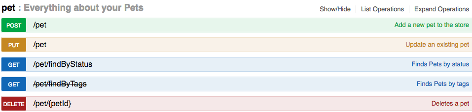
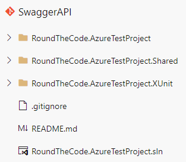
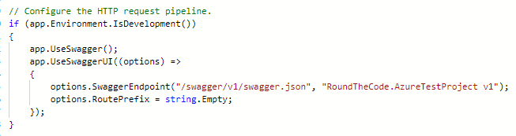
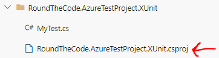
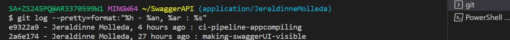
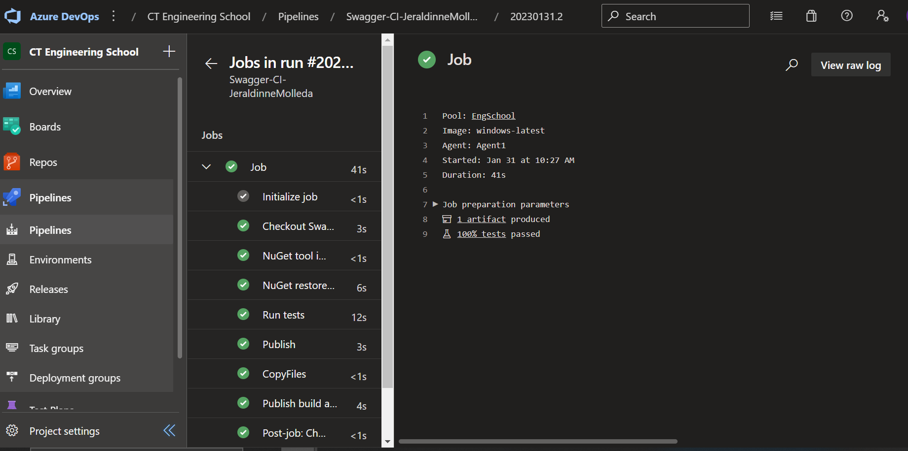
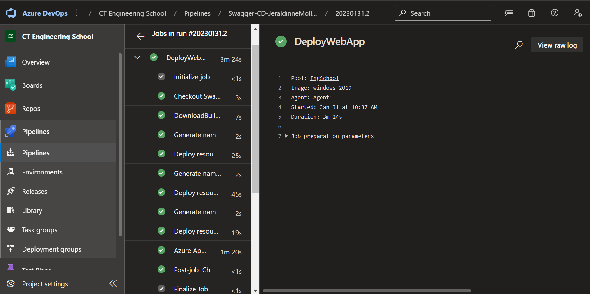
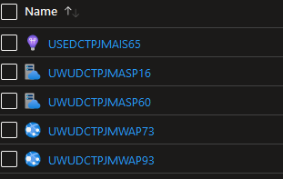
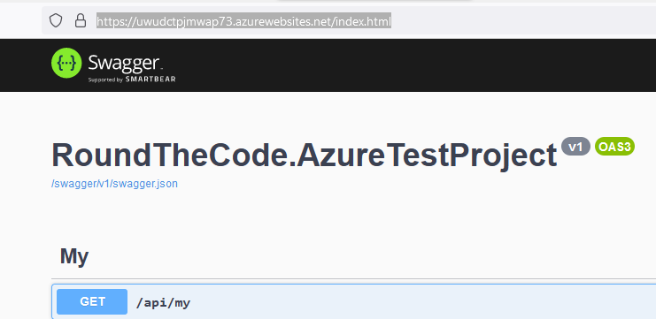

# Azure DevOps Module - Final Assesment

Hello traveler!

In this last exercise we will build a Swagger API application, and make it available through an Azure App Service.

## 1) Introduction
If you ever worked in backend programming or API creation, you probably know that Swagger is a tool where you can describe each endpoint of your API and test calling such endpoints to see the output.

As part of the assessment, you will be responsible for building a CI pipeline which compiles an ASP.NET  Swagger application and publish it as a ZIP. Then you'll create a CD pipeline that will take care of the infrastructure deployment (App Service + App Service Plan) and finally will deploy the application in the server.

Pipeline format must be in YAML

You'll have to make usage of YAML Templates

Application is written in .NET (C#)

## 2) Code Repository
### A) Swagger Repository
The repository is called "SwaggerAPI" and you can find in the Azure Repos of this project.

Create a branch of your own using the following naming standard: application/<Candidate-Name>
For example: application/PabloCorrea

Your CI pipeline will have to take this repo/branch of your own.

Clone the repository to your local machine.

Working with GIT
Opss! A developer just informed a bug that can be quickly fix from the source repo.

There's a change you will have to do in the code, in order to make the Swagger UI visible from the App Service:

Working locally in your machine, open Program.cs from the path: RoundTheCode.AzureTestProject/Program.cs

Remove the IF conditional seen above, leaving only the code that is the inside the IF conditional. The condition will not be considered hence the UI will be run correctly.

Perform these steps and push the changes to your Azure DevOps branch only using GIT commands.

#### 2) CI Pipeline: App Compiling
Your CI pipeline should cover the following tasks:

Use NuGet: Because the application code has dependencies with some libraries that has to be restored, we need to tell the agent to use NuGet to restore such dependencies.

NuGet Restore: This will restore the mentioned dependencies for the code to be able to compile correctly.

Use Dotnet: Because we are compiling a .NET application we have to use DotNet to perform the same. Version should be "6.x"

Test: The application also has some unit tests in place that we have to automate during the CI. Make sure to include this task during your CI.

Publish: This task will build and publish the compiled code into a ZIP ready to be deployed.

Publish Artifact: Lastly, we will publish the artifact so then we can use it in a Release Pipeline.

### Useful Links:
- [Azure DevOps pipeline build with .NET for CI/CD](https://www.roundthecode.com/dotnet/azure/azure-devops-pipeline-build-dotnet-ci-)

- [Build, test, and deploy .NET Core apps](https://learn.microsoft.com/en-us/azure/devops/pipelines/ecosystems/dotnet-core?view=azure-devops&tabs=dotnetfive)

### 3) CD Pipeline: Azure Deployments
You'll have to create a CD Pipeline that will handle the resource deployment into Azure, where we will run our Swagger Application. For this part, you will have to create 2 PowerShell scripts:

One script that generates the name of the Azure resource based on certain conditions (location, resource type, project name, etc.). This script will save a variable that'll be used in the next task. Check on the 'Naming Convention' part below.

One script that picks up the variable from the previous script, and will use the value of that variable for the name of the Azure resource. Then it will deploy it into Azure.

Both scripts should be uploaded to your repository/branch within a folder called 'scripts'. Then in the pipeline, at each PowerShell task, we'll define the location of each script.

1) Resource Group:
Location: East US
Environment: Development

2) App Service Plan:
Location: West US
Environment: Development
Pricing Tier: F1 (Free)

3) App Service:
Location: West US
Environment: Development

4) Application Insights (Optional):

If you'd like you can also deploy an App Insights and associate it to the Azure Web App. Extra points on this 😉

Location: East US

### Useful Links:
-[Using Azure PowerShell Commands To Create An App Service Web App](https://www.c-sharpcorner.com/article/using-azure-powershell-commands-to-create-an-app-service-web-app/)
-[How to create an Azure web app using PowerShell](https://azurelessons.com/create-azure-web-app/#Create_an_Azure_web_app_from_Azure_Portal)

Naming Convention Script
Your script should be able to generate the name of each Azure resource, based on the following conditions

Location: The geographic location of the desired resource.
Environment: The environment we want to target. For this exercise we will use Development
Project Name: 3 letters from the Project Name. For this exercise we use CTP
Candidate Name: First letter of your name, and first letter of your last name. (JM = Jeraldinne Molleda)
Azure Resource: The abbreviation of the Azure resource. Check the table below in 'Azure Components'
Instance Number: Number of instance (01, 02, 03, etc.)
Example:

The name of an App Service deployed in West US would be: UWUDCTPJMWAP01

UWU => West US
D => Development
CTP => Project Name
PC => Candidate Name
WAP => Web Application
01 => Instance Number
Useful Links:
Set variables in scripts 

Azure Devops | Pipeline Output Variables 

Below tables are the information your script need to have.

Your script should throw a 'Not supported' error if we pass any parameter that does not match with below table information.

# My Solution

## 2) Code Repository
Clone the repository to your local machine. ✅   
Create a branch of your own using the following naming standard: application/JeraldinneMolleda.   ✅    
Remove the IF conditional in Program.cs file from the path given. ✅ 
Reference Commit 2a6e174:

## CI Pipeline: App Compiling:
Configure Continuous Integration pipeline (CI) using YAML. ✅
Your CI pipeline should cover the following tasks: Use NuGet, NuGet Restore, Use Dotnet, Test, Publish, Publish Artifact ✅

## CD Pipeline: Azure Deployments
Create a Continuous Delivery Pipeline that will handle the resource deployment into Azure. ✅
Create one script that generates the name of the Azure resource. ✅
Create one script to deploy the resource into Azure.  ✅
Both scripts should be uploaded to your repository/branch within a folder called 'scripts'.  ✅

